# Salesforce Digital Channel Configuration

## Task 01

###<code style="color : green">**Create Routing Configurations**</code>

---

* Use a browser window and [login to Salesforce](https://login.salesforce.com/) using pod credentials assigned

!!! Important
    Please contact your proctor if prompted for a Salesforce verification code.
    
* Click on the gear icon on top right corner and select Setup from the drop down menu.
* From Setup Quick Find box, search and select **Routing Configurations**
* Click on New button to create a new routing configuration.

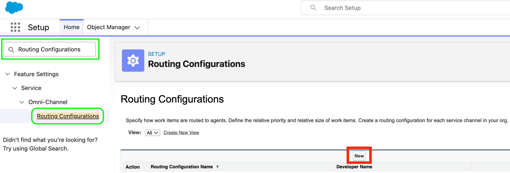{ width="800" }

* Enter following details - see screenshot below 
* **Basic Information**
    - Routing Configuration Name (ex: SCVChat Routing Cfg)
    - Developer Name (accept auto-populated or edit)
    - Ignore Overflow Assignee (User/Queue)
* **Routing Settings**
    - Set Routing Priority (lower number = higher priority)
    - Select Routing Model (e.g., Most Available)
    - Enter Push Time-Out (seconds) (e.g. 120 Seconds)
    - Choose Capacity Type (Inherited or Dedicated)
* **Work Item Size**
    - Enter Units of Capacity or Percentage of Capacity (only one)

* Click Save.

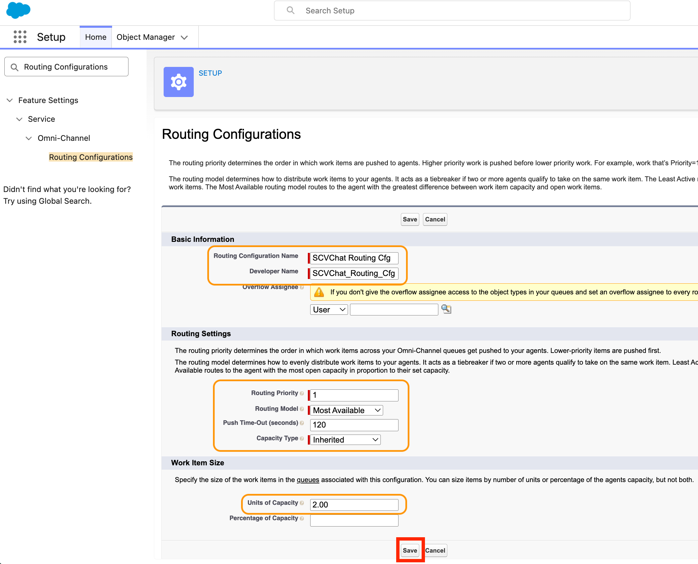{ width="1000" }

## Task 02

###<code style="color : green">**Create a Messaging Queue**</code>

---

* From Setup Quick Find box, search and select **Queues**
* Click on the New button to create a new Queue.

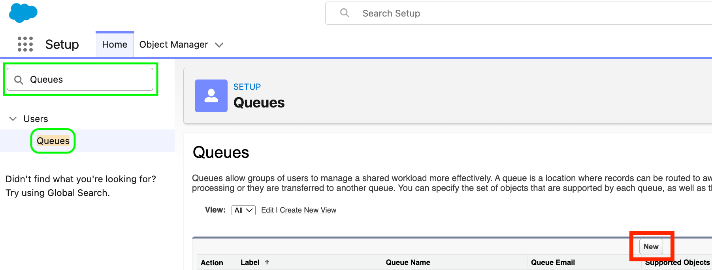{ width="800" }

* Enter following details - see screenshot below
* **Queue Name and Email Address**
    - Label (ex: SCVChatQueue)
    - Queue Name (accept auto-populated or edit)
    - Optional: Queue Email and Queue Description
* **Configuration with Omni-Channel Routing**
    - Select Routing Configuration created in the previous Step. (ex: SCVChat Routing Cfg)
* **Supported Objects**
    - Move Messaging Session from Available Objects to Selected Objects
* **Queue Members**
    - Select member type (Users / Roles / Groups)
    - Add your user(s) (ex: agents) to Selected Members

* Click Save.
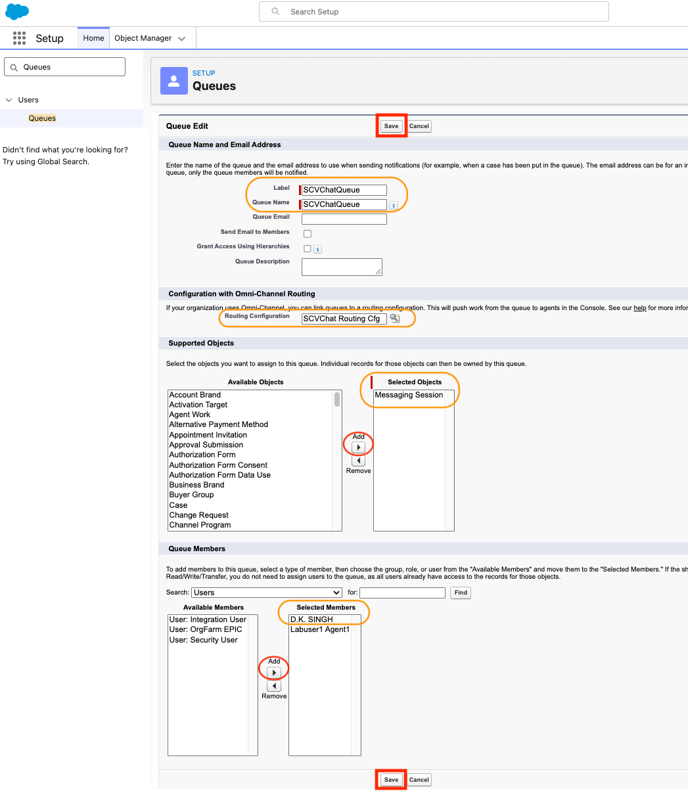{ width="800" }

!!! Note
    You don’t necessarily need to create a new Presence Status. You can modify an existing online presence status to add Messaging Channel. If you choose this approach, you can skip next two steps and jump to task 5.   

## Task 03

###<code style="color : green">**Create a Presence Status for Messaging**</code>

---
    
* From Setup Quick Find box, search and select **Presence Statuses** and click on New button.
* Enter following details - see screenshot below
* **Basic Information**
    - Status Name (ex: Avilable Chat and Voice)
    - Developer Name (accept auto-populated or edit)
* **Status Options**
    - Select Online (to allow agents to receive work)
* **Service Channels**
    - From Available Channels, add Messaging (or both, Messaging and Phone)

* Click Save.
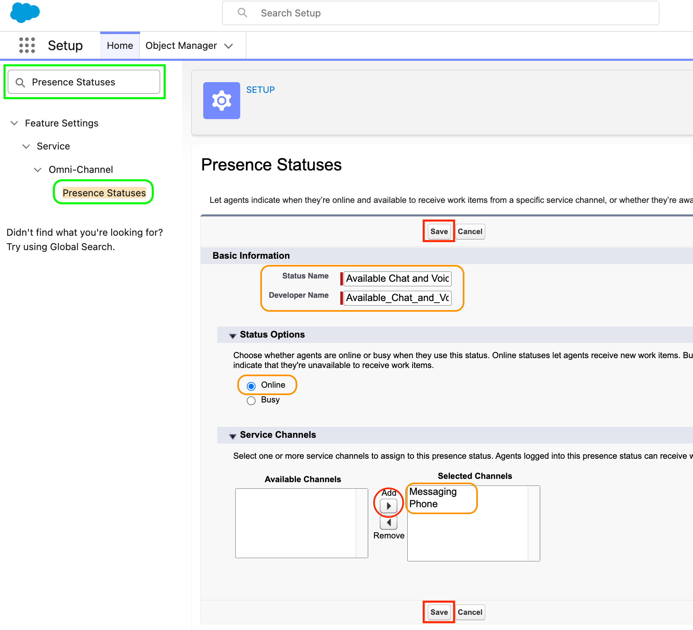{ width="800" }

## Task 04

###<code style="color : green">**Assign the Presence Status to the Agents**</code>

---
    
* From Setup Quick Find box, search and select **Permission Sets**
* Click to open Partner Telephony Permission Set
* Click Service Presence Statuses Access
* Click Edit button
* In the Available Service Presences Statuses list, select the presence status(es) previously created and click Add to associate them with the permission set. Agents who are assigned to this permission set can sign into Omni-Channel with any of the presence statuses made available to them.
* Click the Save button.

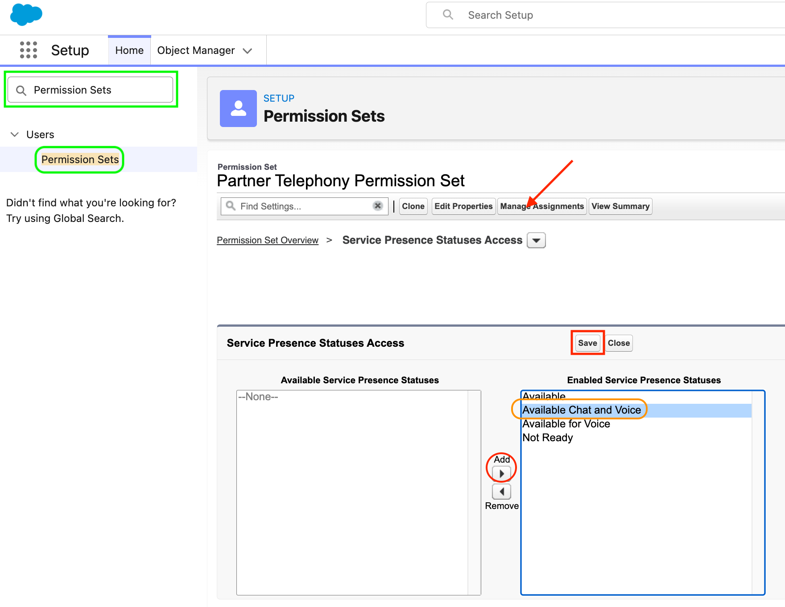{ width="800" }

!!! Note
    Following steps are optional if not performed in the previous lab Task 07: Assign Presence Status(es) to Agent(s)
    
* Click on Manage Assignments on the same page (screenshot above)
* Then click Add Assignment on the top right corner, select the desired user.
* Click Next, select an Expiration Option for the assigned users (Optional) and then click Assign and Done.  

## Task 05

###<code style="color : green">**Enable Digital Experiences**</code>

---
    
* From Setup Quick Find box, search for **Digital Experiences** and click on **Settings** under it.
* Click on checkbox to Enable Digital Experiences and Save.
* Click the Save button.

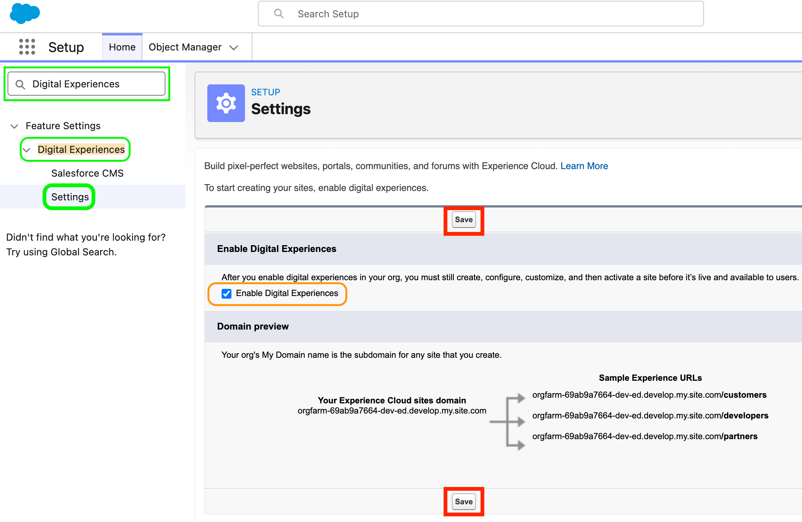{ width="800" }

## Task 06

###<code style="color : green">**Enable Digital Experiences**</code>

---
    
* From Setup Quick Find box, search and select **Messaging Settings**
* Move the slider to enable Messaging to ON.

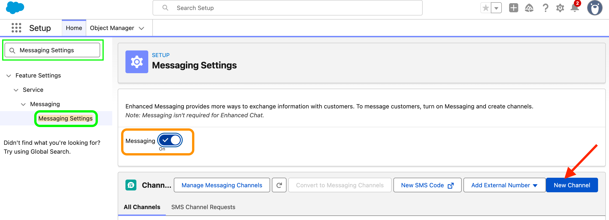{ width="800" }

## Task 07

###<code style="color : green">**Setup Messaging Channel**</code>

---
    
* Click **New Channel** button - see screenshot above for the previous step (Messaging Settings)
* Click Start button
* Select Enhanced Chat

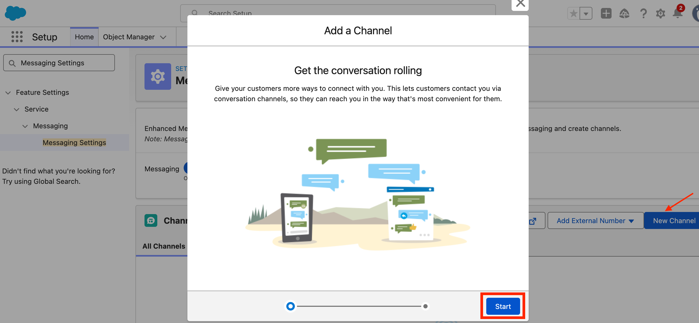{ width="800" }
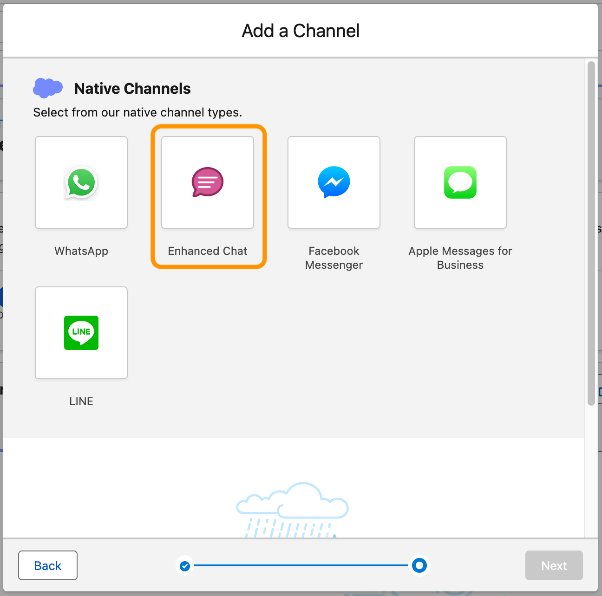{ width="800" }
  
* Enter following details for **Add a Channel**  - see screenshot below
  - Channel Name (ex: SCV Chat)
  - Developer Name - accept auto-populated or edit (ex: SCV_Chat)
  - Select Deployment Type as **Web**
  - Enter a dummy Domain for testing (ex: myscvchat.com)
  - Click Next

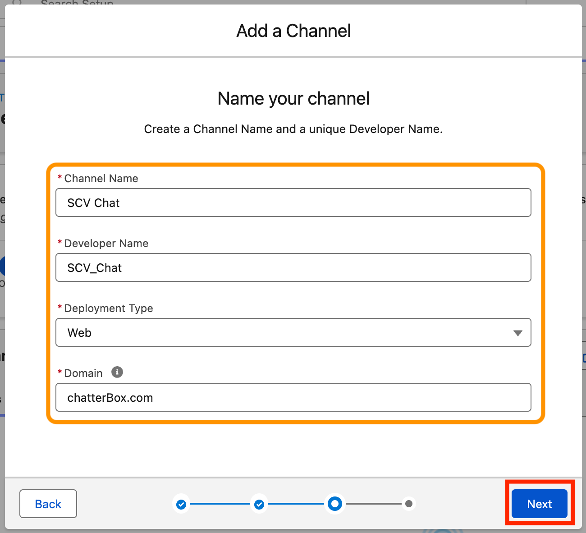{ width="800" }

* Enter following details for **Channel Routing**  - see screenshot below
  - Routing Type: Omni-Queue
  - Associate the channel with the Queue created in Task 02 above: Create a Messaging Queue
  - Click Save

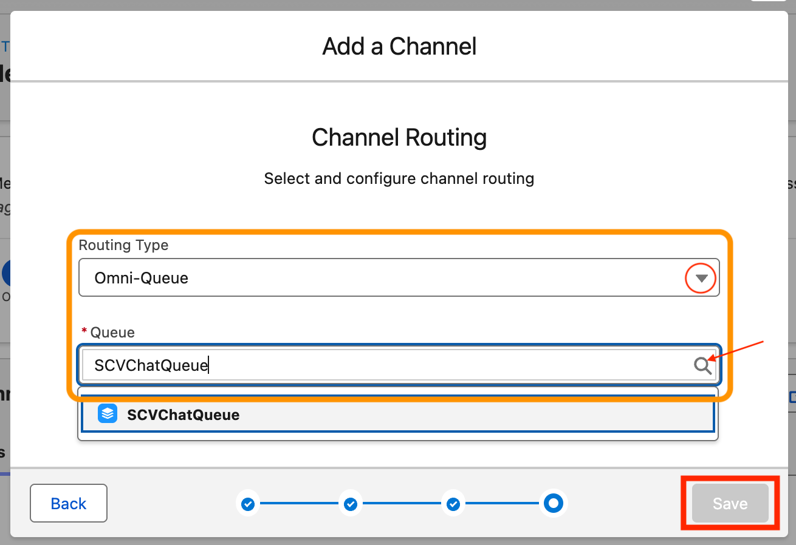{ width="800" }

  - Accept Terms and Conditions and hit Save again
  - Wait for Channel creation and deployment which may take a few minutes

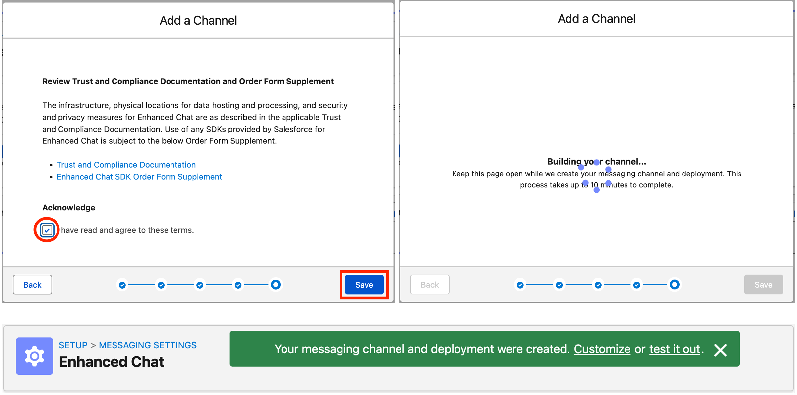{ width="800" }

## Task 08

###<code style="color : green">**Create a Lightening Page For “Messaging Session” Object**</code>

---
    
* From Setup Quick Find box, search and select **Object Manger**
* From Object Manager Quick Find box, search and select Messaging Session

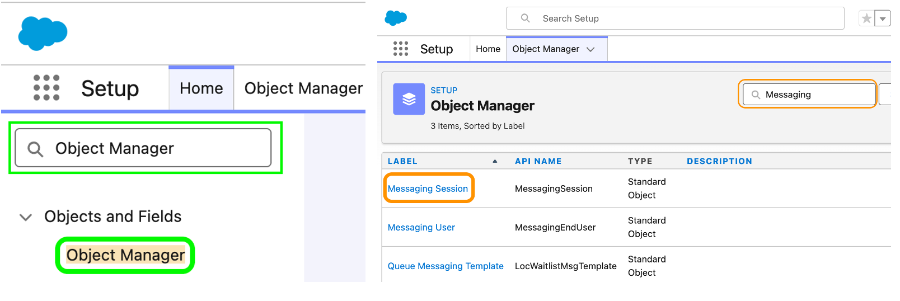{ width="800" }

* From the left panel, select Lightning Record Pages
* Click New to create a new Lightning Record Page.

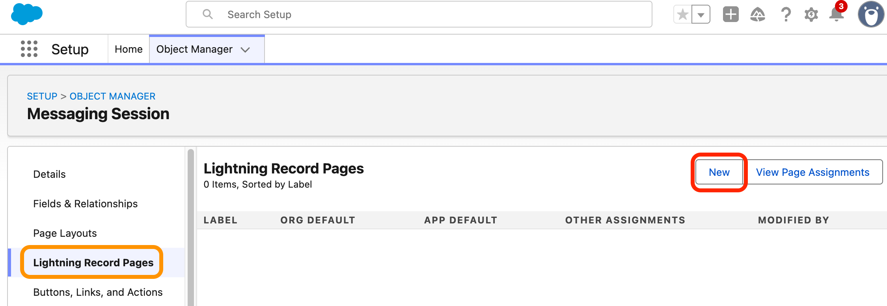{ width="800" }

* Select Record Page option and click Next.

* Enter following details for **Create a new Lightning page**  - see screenshot below
  - Label: (ex: SCV Messaging Session Record Page)
  - Object: Messaging Session
  - Click Next

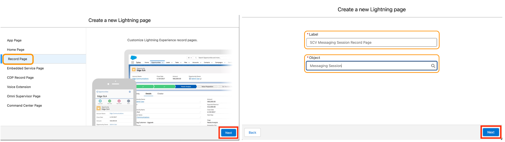{ width="800" }

* Choose Page Template as **Header and Right Sidebar** and click Done

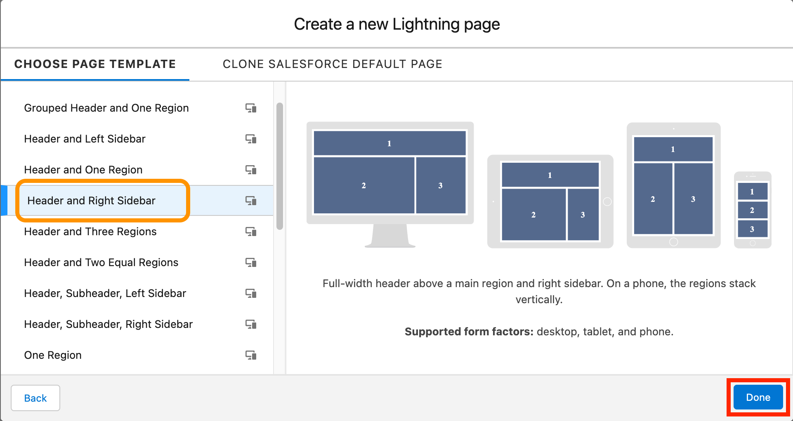{ width="800" }

* On the Lightning App Builder
  - Enhanced Conversation from the left panel to the Center (Main) region.
  - Highlights Panel into the Header area
  - Add Record Details and other required components to the Right Sidebar
  - Click Save
  - Click Activate on Page Saved confirmation window.
 
  - Assign as Org Default and select Desktop and phone.
  - Click Next.
  - Save

## Task 09

###<code style="color : green">**Test Chat Functionality**</code>

---

* From the Setup Quick Find search box, type Messaging Settings and select it
* Select the Channel created in previous Task 07: Setup Messaging Channel
* Select Channel Name (ex: SCV_Chat) under Embedded Service Deployments
* Scroll down and select Test Enhanced Web Chat

{ width="800" }

* This opens a new Browser tab. Click on the Chat Bubble to initiate the chat

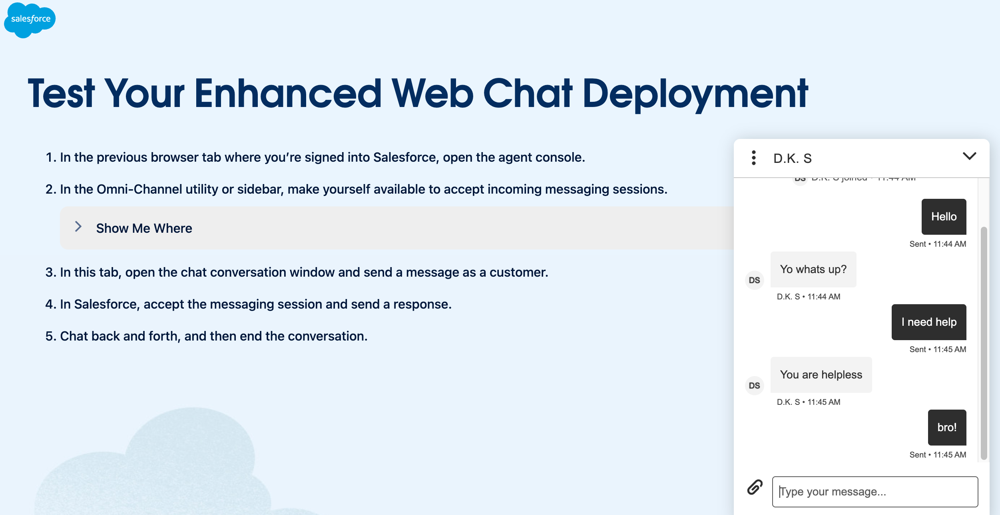{ width="800" }

* Login the agent and make it Available for Presence Status created in Step 43: Create a Presence Status for Messaging.
* Agent should now receive the chat and should be able to answer from the Omni-Channel widget.

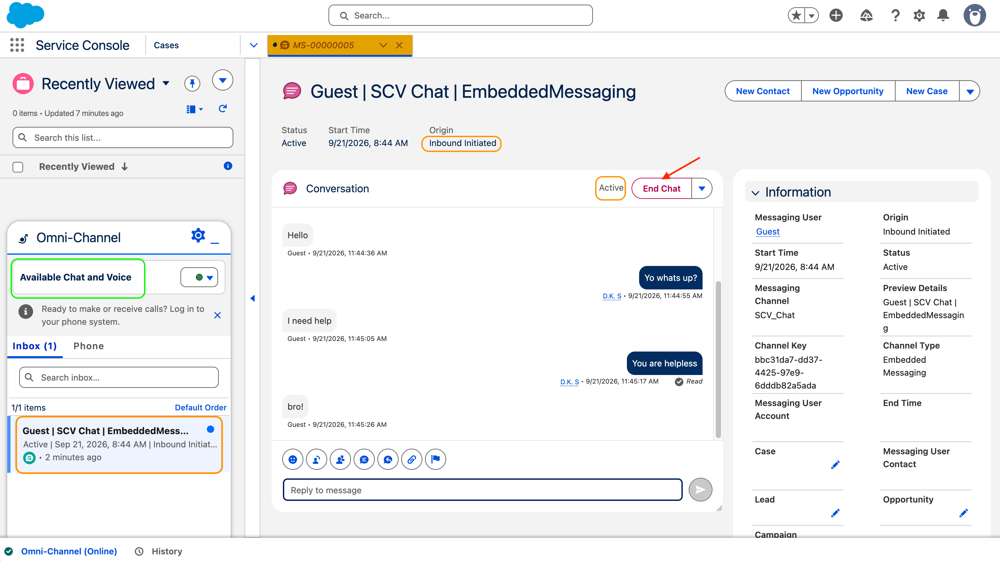{ width="800" }
