# Testing inbound and Outbound calls 

Please use the PSTN Number assigned to your pod to make the inbound call:

| Pod#              |  PSTN Number            | Agent username           |  Agent Password  |
| :---------------: | :---------------------: | :----------------------: | :--------------: |
| 01                |   978-339-7153          | labuser1@clus26.wbx.ai   | Clus2026!        |
| 02                |   978-339-7154          | labuser2@clus26.wbx.ai   | Clus2026!        |
| 03                |   978-339-7155          | labuser3@clus26.wbx.ai   | Clus2026!        |
| 04                |   978-339-7157          | labuser4@clus26.wbx.ai   | Clus2026!        |
| 05                |   978-339-7159          | labuser5@clus26.wbx.ai   | Clus2026!        |

!!! info
	Webex Contact Center now supports Web Real-Time Communication (WebRTC) for Agent Desktop using the Next Generation Media Platform (RTMS).
	With this feature, agents can use Agent Desktop with a headset without an external phone or extension number. Agent Desktop supports all current voice functionalities such as hold, retrieve, transfer, and conference. Features such as mute, auto-answer, and dial pad are added to Agent Desktop to facilitate browser-only use.

### Log into Salesforce 

Open a new Chrome window and [log in to Salesforce](https://login.salesforce.com/) using credentials provided.

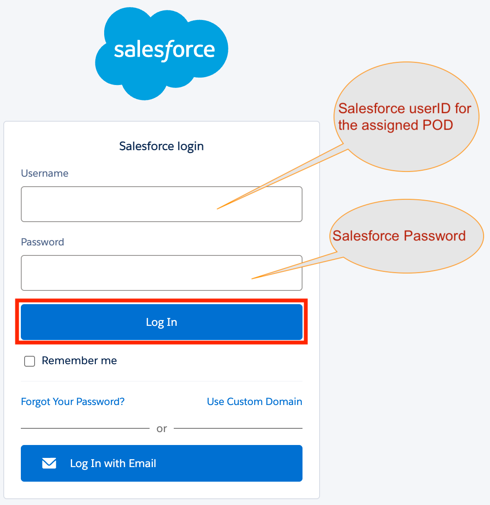{ width="300" }

- Click on App Launcher on the top left and select Service Console from the drop down menu

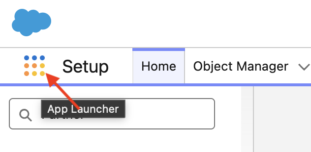{ width="300" }
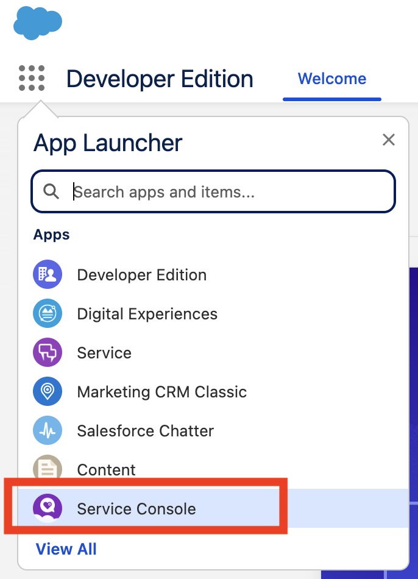{ width="300" }
<!--  { width="400" } -->

!!! Note  
     _If you enabled Omni-channel for another app select that from the App Launcher._  
	 
      Allow microphone access to the browser if prompted.

- Click on Omni-Channel in the browser status bar at the bottom left to open WxCC agent console
- Click on Authenticate button and provide agent ID and password (see table above)

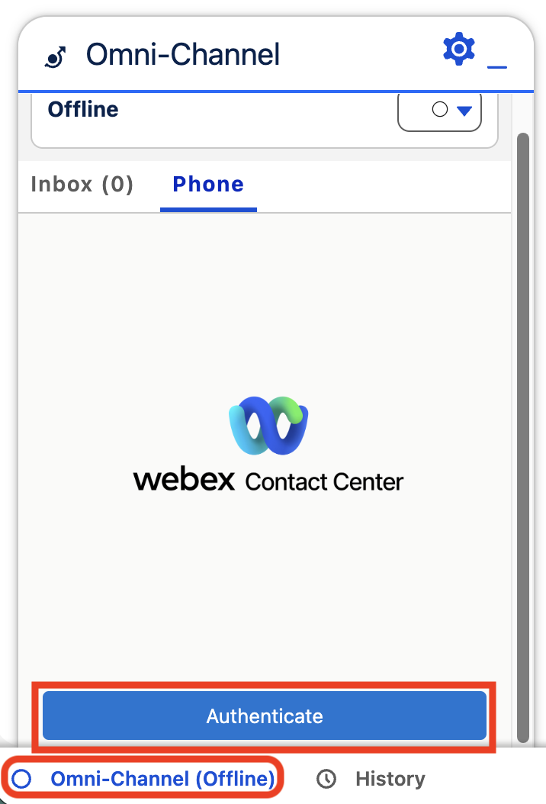{ width="300" }
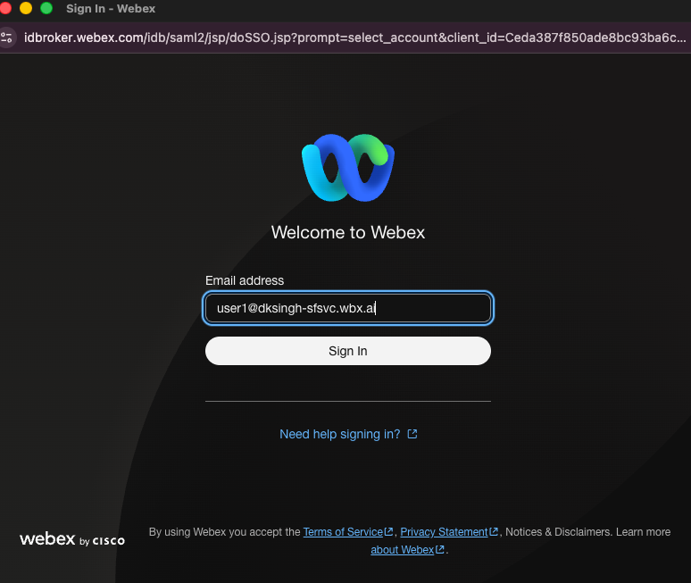{ width="500" }
<!-- 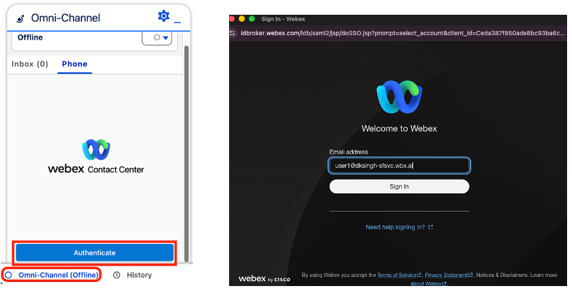{ width="400" } -->
  
-  Login in to the agent console using the **Desktop** option  

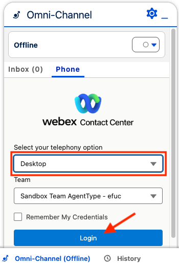{ width="300" }
 
!!! Note  
     _Accept any permission requests if prompted._
	 
## Place Inbound & Outbound Calls to/from Agent Console

- Before testing call, first please change Agent status to Available by clicking on status button on top.

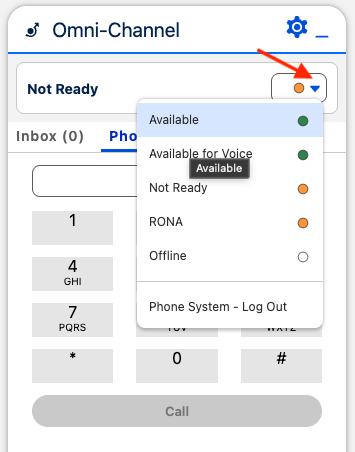{ width="300" }

Using your cell phone, dial the PSTN number for your pod (see table above) to place an inbound call to the contact center.  
Answer the call using Agent desktop and analyze the voice call record generated.

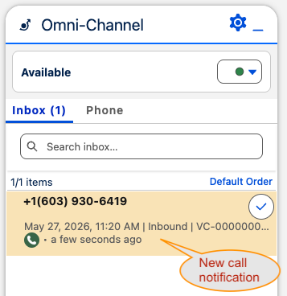{ width="300" }
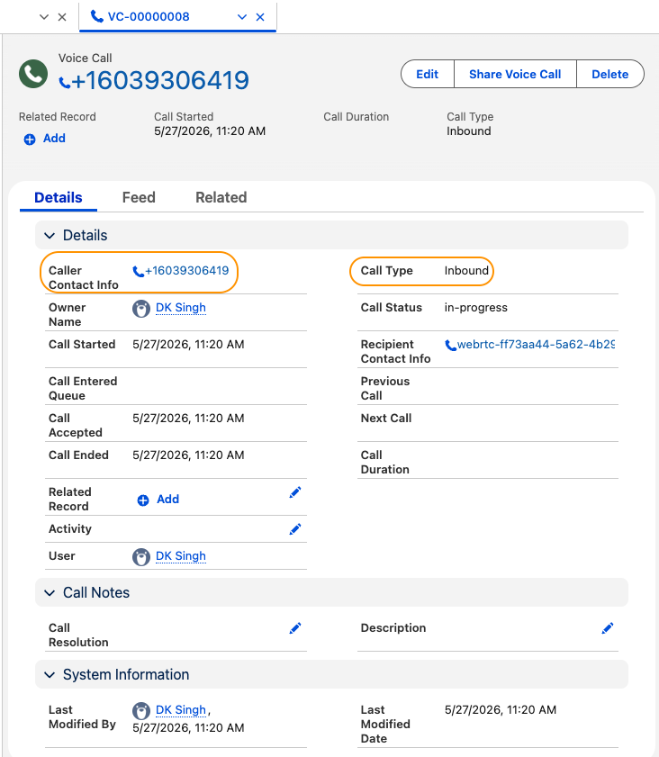{ width="500" }

For testing outbound call, use the agent dialpad to call your cell phone.

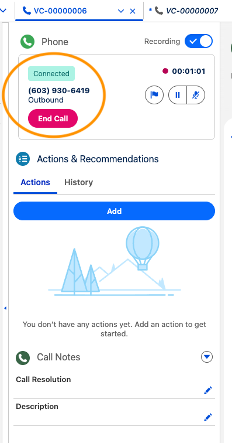{ width="300" }
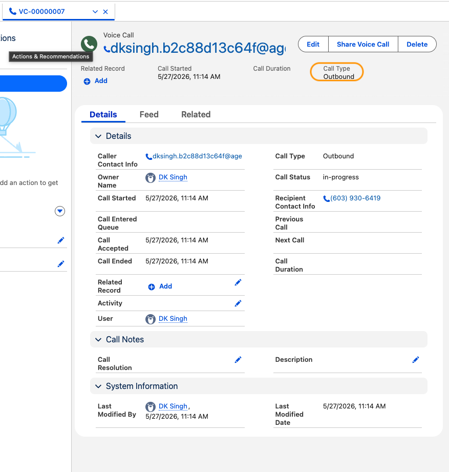{ width="500" }

For each voice interaction a VoiceCall record is displayed with call details, actions, notes etc.
This layout can be customized based on business requirements.

