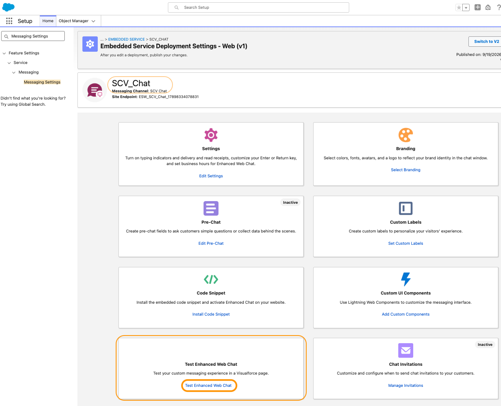

# Testing Chat Functionality 

### 

- From Setup Quick Find box, search and select **Messaging Settings**
- Select the Channel created in previous Task 07: Setup Messaging Channel
- Select Channel Name (ex: SCV_Chat) under Embedded Service Deployments
- Scroll down and select Test Enhanced Web Chat

{ width="800" }

- This opens a new Browser tab. Click on the Chat Bubble to initiate the chat

{ width="800" }

### Log Agent into Salesforce 

!!! Note  
     Refer to Previous Lab's testing section for details on Salesforce and Agent login process.

	 
- Log in the agent and make it Available for Presence Status  (ex: Available Chat and Voice) created in Task 03: Create a Presence Status for Messaging.
- Agent should now receive the chat and should be able to answer from the Salesforce Omni-Channel widget.

{ width="800" }

For each Chat interaction a VoiceCall record is displayed with call details, actions, notes etc.
This layout can be customized based on business requirements.

