# Integration: Webex Contact Center (WxCC) with Salesforce Service Cloud Voice (SVC)

## Lab Access:
Please use the following credentials to complete the tasks:


| <!-- -->                | <!-- -->                        |
| ----------------------- | ------------------------------- |
| `Webex Control Hub`     | https://admin.webex.com         |
| `Salesforce`            | https://login.salesforce.com    |
| `WxCC Username`         | Provided by the instructor      |
| `WxCC Password`         | Provided by the instructor      |
| `Salesforce Username`   | Provided by the instructor      |
| `Salesforce Password`   | Provided by the instructor      |

## Task 01

###<code style="color : green">**Verify Salesforce Voice for Partner Telephony Licenses Entitlement**</code>

---

* Open a Chrome ingonito (private) window and login to Salesforce using pod credentials assigned (see table above)

!!! Important
    Please contact your proctor if prompted for a Salesforce verification code.
    
* Click on the gear icon on top right corner and select Setup from the drop down menu.
* From Setup Quick Find box, search and select **Company information**
* Scroll down to Permission Set License section and check for **Salesforce Voice User (Partner Telephony)**  

<!--  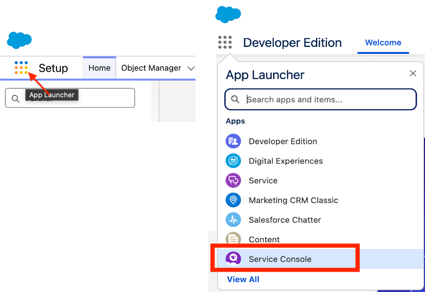{ width="400" } -->

<!-- ! -->

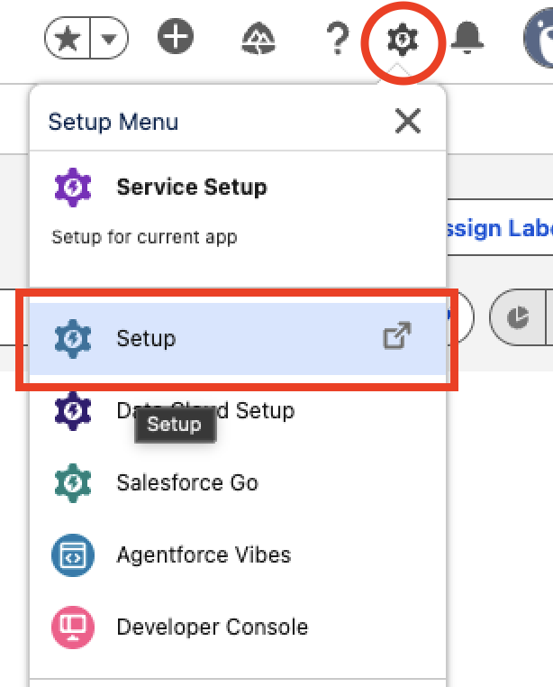{ width="300" }

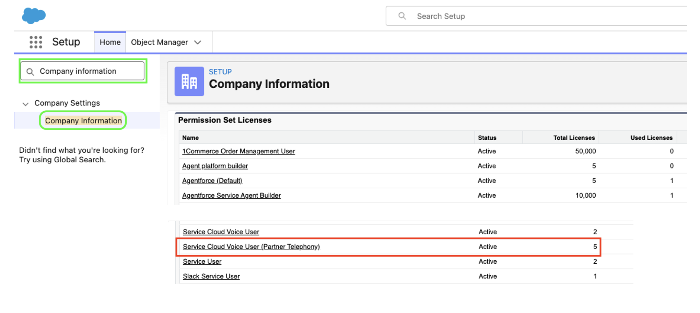{ width="800" }


## Task 02

###<code style="color : green">**Enable Omni-Channel**</code>

---

!!! Note
    Review (Skip if Omni-Channel setting is already Enabled.)


* From Setup Quick Find box, search and select **Omni-Channel Settings**
* Move the slider to enable Enhanced Omni-Channel Routing.
* Select Enable Omni-Channel and Click Save.

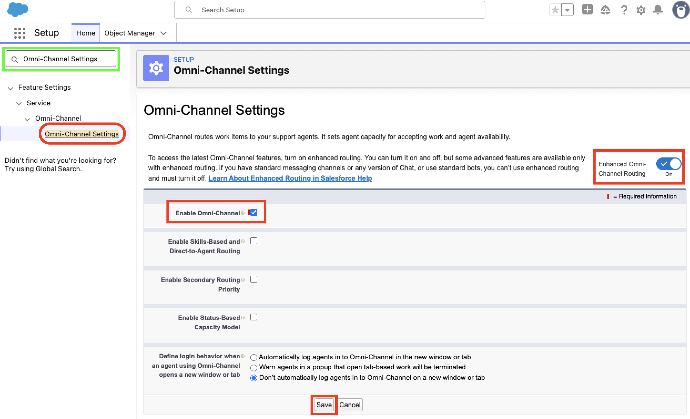{ width="800" }


## Task 03

###<code style="color : green">**Enable Salesforce Voice - Turn on Voice with Partner Telephony**</code>

---

!!! Note
    Review (Skip if already Enabled.)

    
* From Setup Quick find box, search and select **Partner Telephony Setup** and toggle the button for Enable Service Cloud Voice.
* Scroll down to More Voice Settings section and make sure Respect Agent Capacity is Disabled or Off.

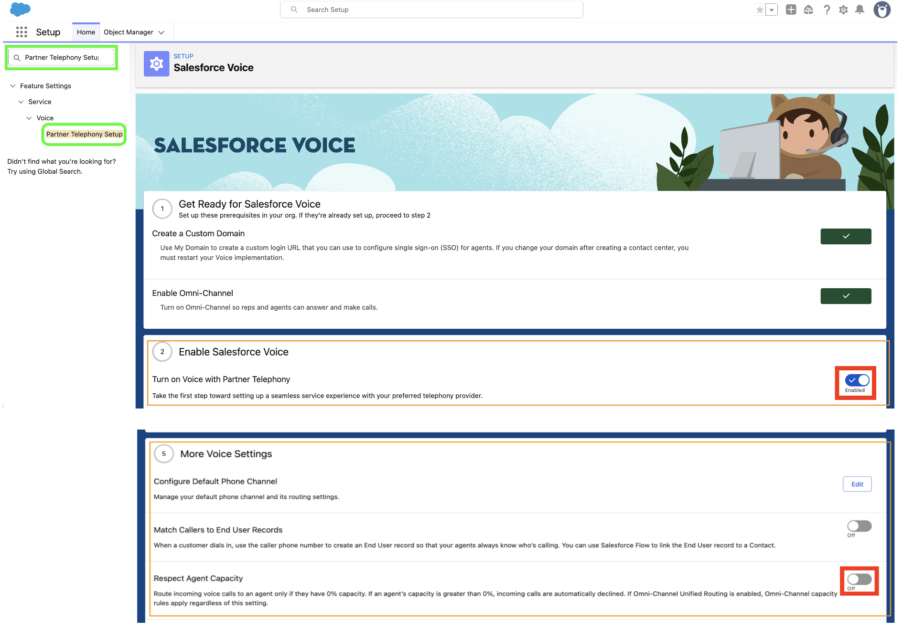{ width="800" }


## Task 04

###<code style="color : green">**Verify that Service Cloud Voice Package is Installed**</code>

---

!!! Note
    _Review only - SCV package for the WxCC is already isntalled. See below for installation information._
    
* From Setup Quick find box, search and select **installed Packages**
* Under Installed Packages verify that Webex Contact Center for Service Cloud Voice is listed.

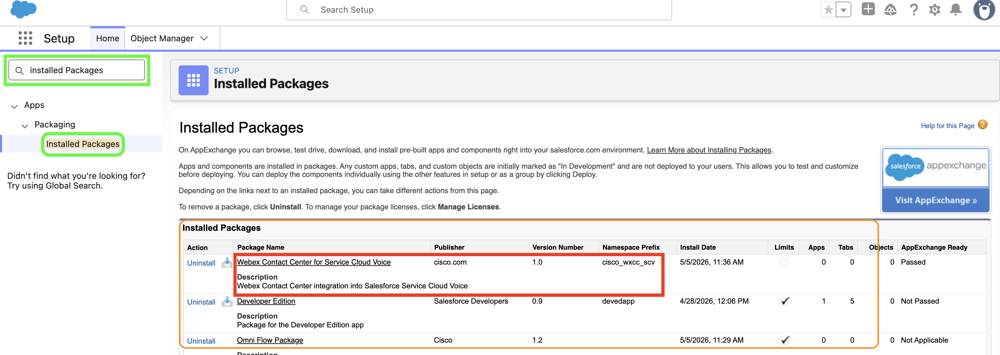{ width="800" }


!!! Reference
    **How to install the Ciso WxCC for SCV package?**  
    
    [Click this link](https://login.salesforce.com/packaging/installPackage.apexp?p0=04tUl000001HN1FIAW) and follow onscreen instructions to install the package in your environment.  
    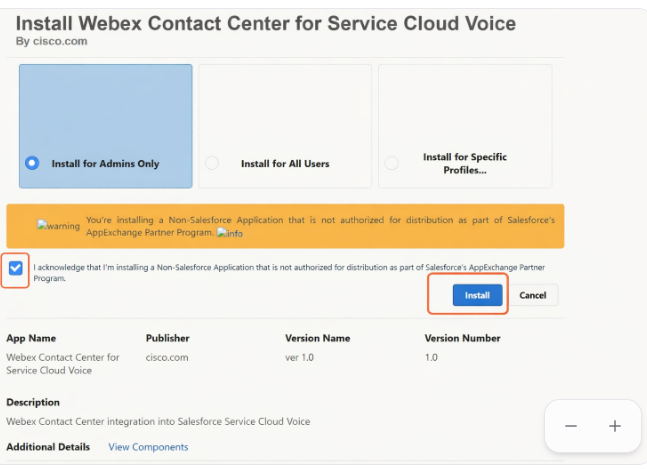{ width="500" }

    Note: _Grant access to 3rd party websites if prompted during installation_


## Task 05

###<code style="color : green">**Assign Contact Center Permission Sets for SCV Contact Center User/Admin**</code>

---


* From Setup Quick find box, search and select **Users**
* Click on your username in the list of users to open user details page.
* Scroll down to Permission Set Assignments and click Edit Assignments button.

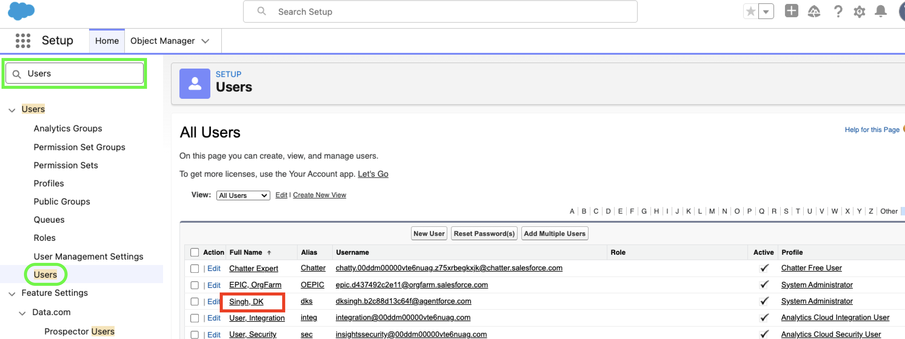{ width="800" }  

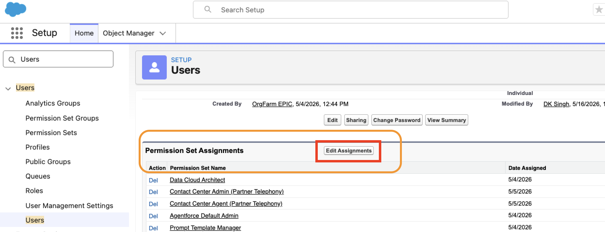{ width="800" }

* Assign Salesforce Voice Contact Center Admin (Partner Telephony) Permission set.
* For agents to have voice capability, assign  Salesforce Voice Contact Center Agent (Partner Telephony) and the Webex Contact Center SCV Agent permission set.
* Click Save button.  

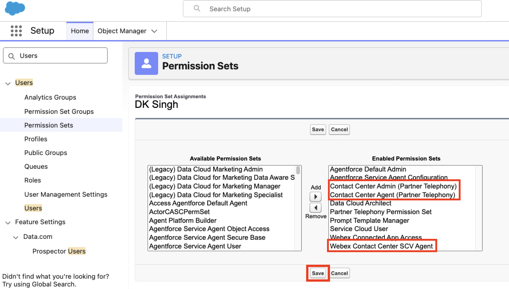{ width="800" }


## Task 06

###<code style="color : green">**Create Presence Statuses**</code>

---

* From Setup Quick find box, search and select **Presence Statuses**
* Click on New button and create at least one status for Online and one for Busy.
* Click Save button for both statuses.


<!--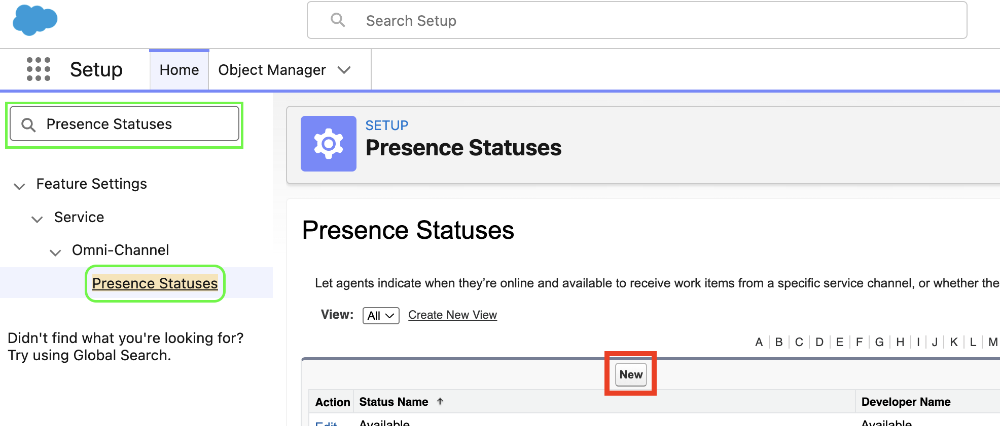{ width="300" } -->
<!-- 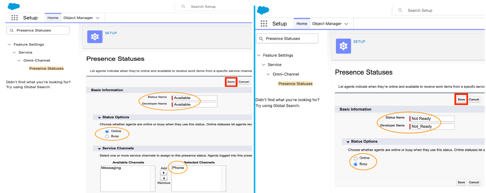{ width="500" } -->


## Task 07

###<code style="color : green">**Assign Presence Status(es) to Agent(s)**</code>

---

* From Setup Quick find box, search and select **Permission Sets**
* Locate and click on Partner Telephony Permission Set  

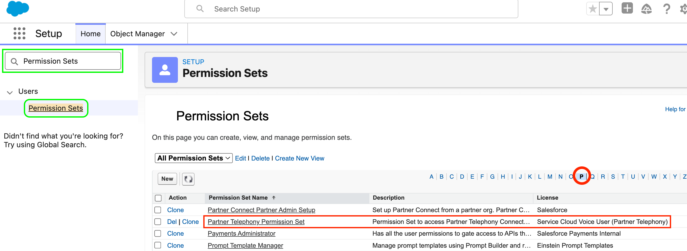{ width="800" }

* Click Service Presence Statuses Access.

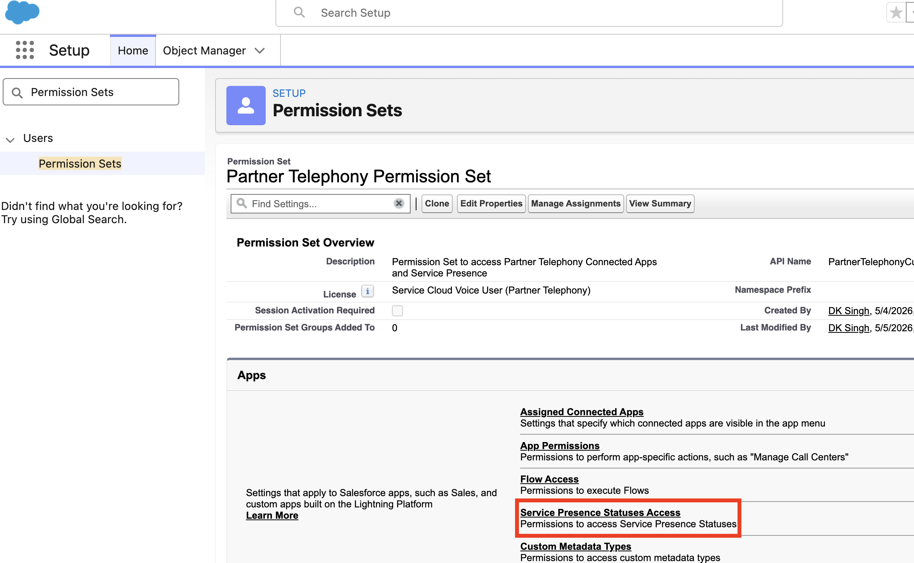{ width="800" }

* Click Edit Button.

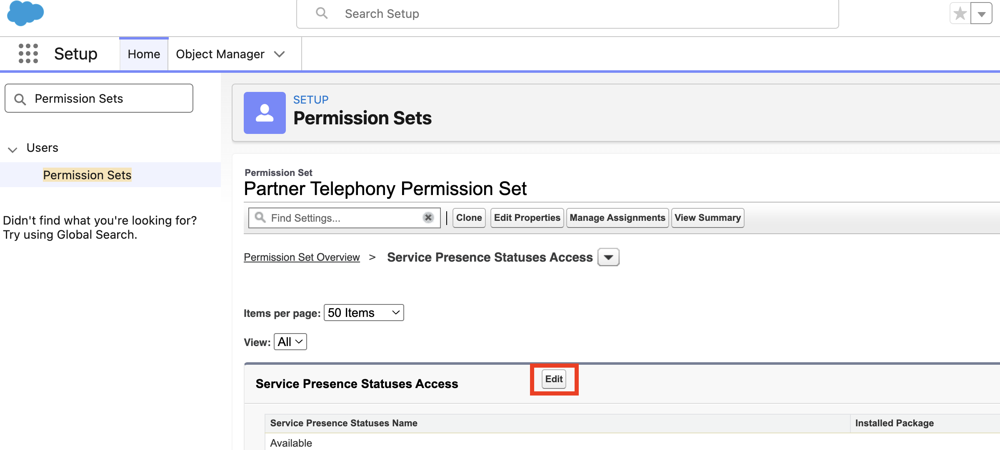{ width="800" }

* In the Available Service Presences Statuses list, select the presence status(es) previously created and click Add to associate them with the permission set. Agents who are assigned to this permission set can sign into Omni-Channel with any of the presence statuses made available to them.
* Click the Save button.

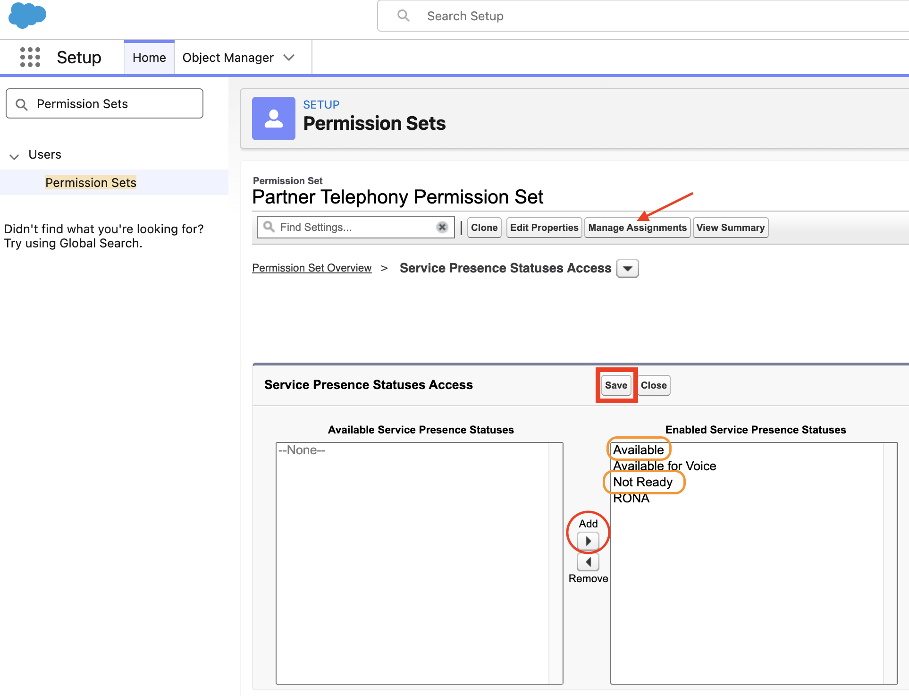{ width="800" }

* Click on Manage Assignments on the same page (screenshot above)
* Then click Add Assignment on the top right corner, select the desired user.
* Click Next, select an Expiration Option for the assigned users (Optional) and then click Assign and Done.  

<!-- ! -->

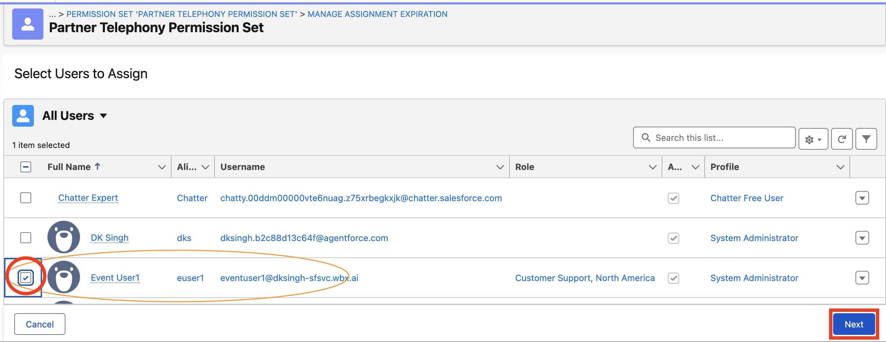{ width="600" }
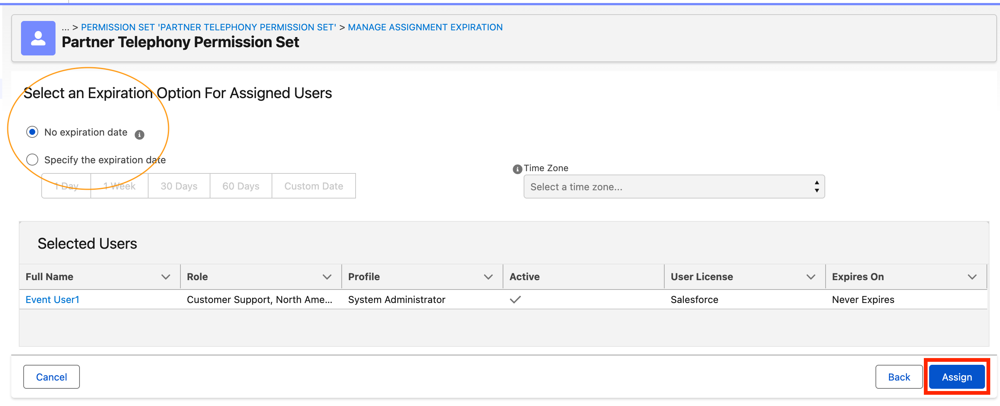{ width="600" }

<!-- 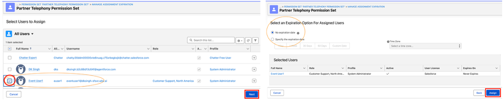  -->


## Task 08

###<code style="color : green">**Add Service Cloud URL as Remote Site**</code>

---

!!! Reference
    **How to Find Your Instance ID?**  
    
    After logging in, check the URL in your browser's address bar. 
    Your instance ID is the portion before any of these domains:  `.my.salesforce.com`   `.salesforce.com`  or `.lightning.force.com`

    For example, if your URL is: https://**orgfarm-5e30277a3a-dev-ed.develop**.lightning.force.com/lightning/page/home  
    
    then <code style="color : Red">YOUR_INSTANCE_ID</code> is: **orgfarm-5e30277a3a-dev-ed.develop**<br>
    
    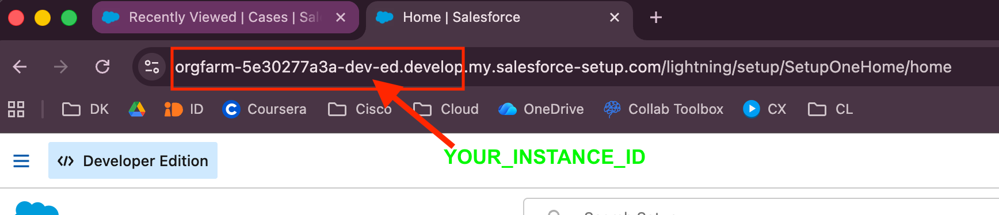

    * Construct 3 URLs to add under Remote Site Setting using the following format:  

         https://<code style="color : Red">YOUR_INSTANCE_ID</code>**.my.salesforce-scrt.com**  
    
         https://<code style="color : Red">YOUR_INSTANCE_ID</code>**--cisco-wxcc-scv.my.salesforce-scrt.com**  
    
         https://webexapis.com  
    

* From Setup Quick find box, search and select **Remote Site Settings**  
* Click the New Remote Site button.
* Provide a Remote Site Name that is both descriptive and unique.
* In the Remote Site URL field, enter each URL identified earlier in the callout above, one at a time. Ensure that the Disable Protocol Security option is unchecked and the Active checkbox is selected.  Optionally, include a description for the remote site.
* Click Save to complete adding the remote site.
  
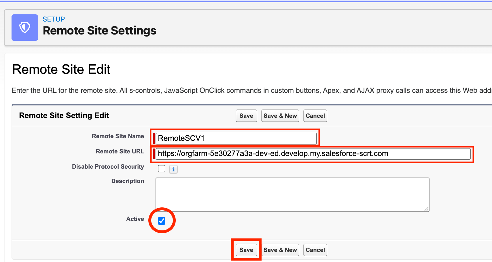{ width="800" }

* After adding all the URLs, the list will appear similar to screensho below.

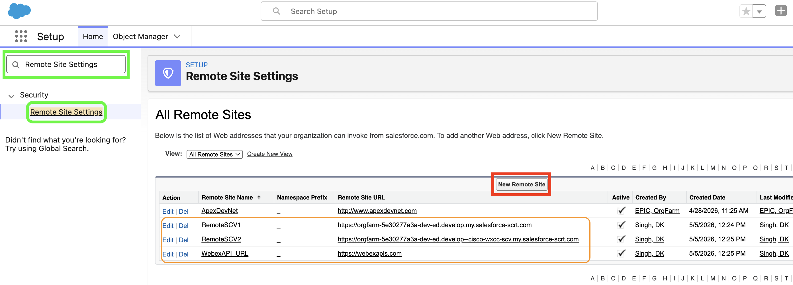{ width="800" }


## Task 09

###<code style="color : green">**Add Omni-Channel to Lightning Service Console (or Custom Lightening page)**</code>

---

* From Setup Quick find box, search and select **App Manager**
* Click the dropdown next to the Service Console app (or other desired app,)  click Edit.

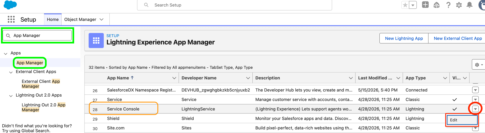

* Under App Settings, click Utility Items (Desktop Only).
* Click Add Utility Item.
* In the modal window, search for Omni-Channel.
* Click Omni-Channel.
* Click Save and exit the App Manager.

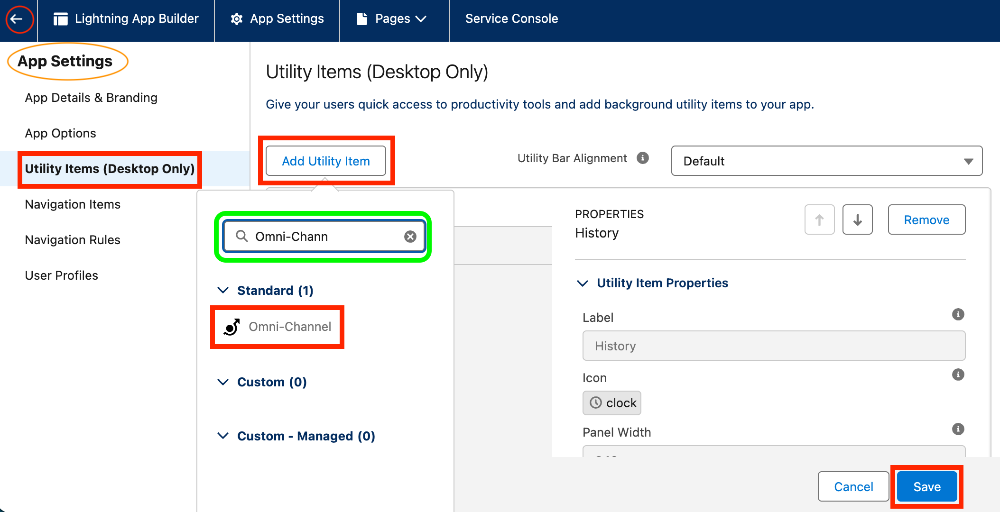{ width="800" }


## Task 10

###<code style="color : green">**Generate Public Key Certificate for Contact Center Configuration**</code>

---

* From Setup Quick find box, search and select **Certificate and Key Management**
* Click on Create Self-Signed Certificate button
* Enter a descriptive Label for the certificate.
* Enter a Unique Name. or use the name that’s automatically populated based on the entered certificate label.
* Select a Key Size for your generated certificate and keys. Click Save.

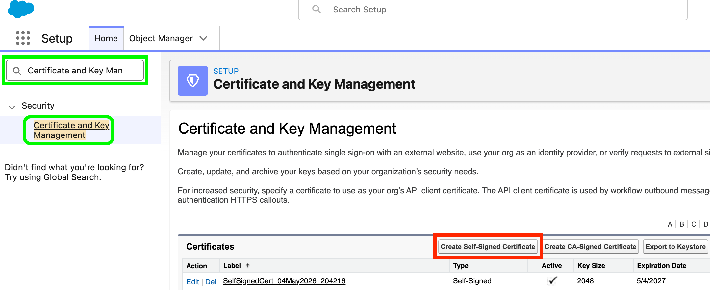{ width="800" }  


!!! Note

    * Download Certificate with (**.crt** extension.) It will be used later in Contact Center Configuration.  
    
    * Make a note of the **Unique Name.** It will be used later in the Contact Center Configuration.  
    
    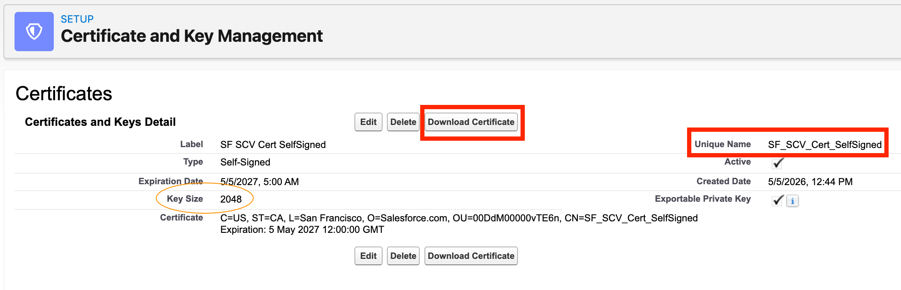


## Task 11

###<code style="color : green">**Import Contact Center**</code>

---


!!! Note
    
    **How to download the Contact Center definition file?  
    
    Before proceeding download the [WxCC Definition File](https://github.com/webex/webex-contact-center-crm-connectors/blob/main/salesforce/servicecloudvoice/WxCCContactCenterSCV.xml)  
    
    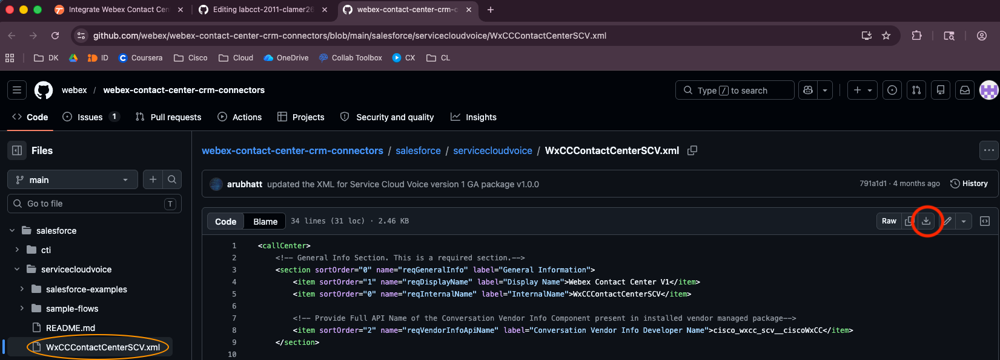
    
    Open and edit the downloaded WxCCContactCenterSCV.xml file to modify lines 4 and 5 as shown below and save it. 

    Add **LabUserX** (**X** = assigned Pod#) to Display Name (Line 4) and InteralName (Line 5) fields. For example:  
    ```   
       <item sortOrder="1" name="reqDisplayName" label="Display Name">Webex Contact Center LabUserX</item>  
       
       <item sortOrder="0" name="reqInternalName" label="InternalName">WxCCContactCenterLabuserX</item>
    ```   


* From Setup Quick find box, search and select **Partner Telephony Contact Centers**
* The list of the existing (if any) Contact Centers is displayed. Click on the New button on the right side of the page.

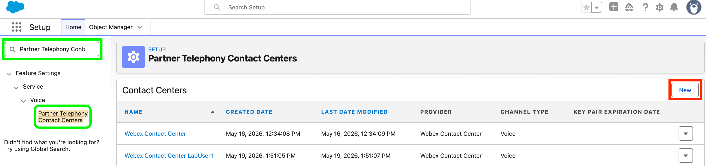

* Select Webex Contact Center as your telephony provider. Click Next.
* A file browser opens. Select the .xml file downloaded above. Click Open to import the file.

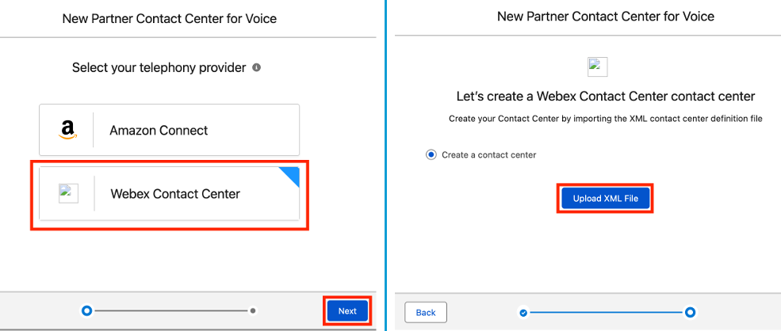
 
!!! Note
    
    Verify that your Contact Center is shown in the Contact Centers list view. 
    Open the contact center just created and note down the API Name to be used later.
    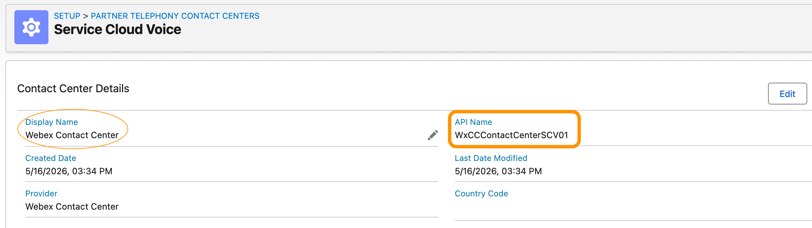


## Task 12

###<code style="color : green">**Configure Contact Center**</code>

---


* Click on the Contact Center Webex Contact Center created in the previous step.
* Click the Edit button on the top right side.
* Copy the content of the certificate downloaded in Task 10: _Generate Public Key Certificate for Contact Center Configuration_ and paste it into the **Public Key** field of the contact center.
* Paste the Unique Name noted down in Task 10: _Generate Public Key Certificate for Contact Center Configuration_ into the **Certificate Unique Name** field of the contact center (under Telephony Settings.)
* Scroll down and Click the Save button.

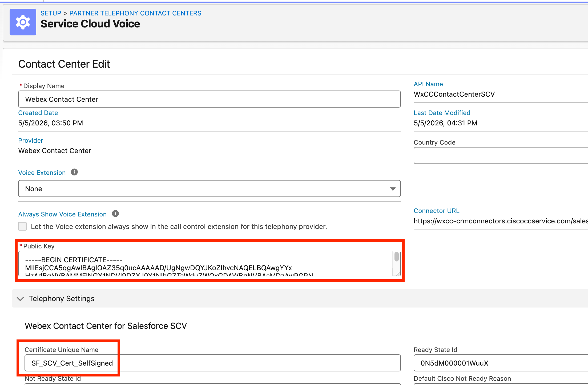{ width="800" }


!!! Note
    Before proceeding with the telephony configuration, we must collect several key IDs:  
    - At least one Online (Ready e.g., Available) presence status ID from Salesforce.  
    
    - At least one Busy (Not Ready e.g., Not Ready) presence status ID from Salesforce.  
    
    - At least one default Not Ready Reason (Idle Code e.g., Not Ready) from Cisco Control Hub.  
    

    These IDs will be required for the Telephony Settings and Presence State Mapping.  


!!! Reference 
     **How to Find Presence Status IDs in Salesforce**  
     
        - From Setup, Quick Find box  search and select Presence Statuses.  
        - Click the Online status you want to use (e.g., Available)  
        - Copy the Salesforce ID from the browser URL.  
    
    Example: If the URL contains address=%2F0N5dM000001WuuX, the ID is 0N5dM000001WuuX (remove %2F)  
    
    
    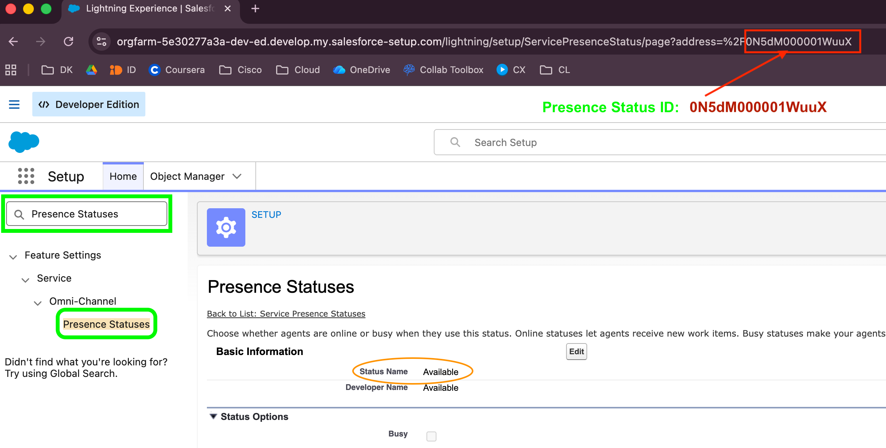  
    

    **Click the Busy status (e.g., Not Ready) and copy its ID similarly.**

    
!!! Note 
    **How to Find the Default Cisco Not Ready Reason in Control Hub**  
    
      - Log into the [Webex Control Hub](https://admin.webex.com)
      - Navigate to Contact Center > DESKTOP EXPERIENCE > Idle/Wrap-up Codes
      -  Make sure that the Idle Codes are displayed, otherwise click the filter drop-down button and select Idle Code at the top of the page
      - Click on an Idle Code to open the detail view. There you can find the Idle Code ID.
      - The IDs can be copied and then used for the Presence State Mapping configuration. One of the IDs has to be used as the Default Cisco Not Ready Reason.  
      
    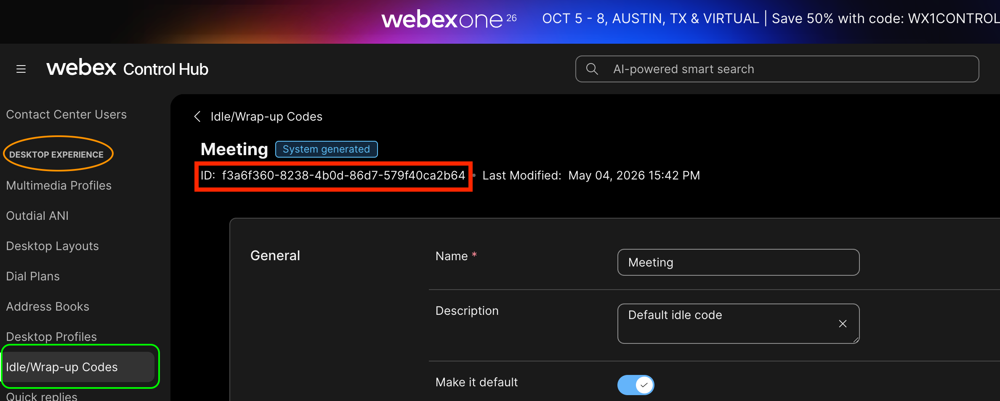


!!! Reference 
    **Presence State Mapping**  
    
    Once you have collected:  
    
      - The Salesforce Online Presence Status ID  
      
      - The Salesforce Busy Presence Status ID(s)  
      
      - The Cisco Idle / Not Ready Reason Code ID  
      
    You can configure Presence State Mapping to connect Salesforce Omni-Channel presence states with Cisco’s Ready and Not Ready codes.
    
    Mapping Format:  
    
    ```    
        busyPresenceID1,ciscoAuxCodeID1;defaultNotReadyPresenceID,ciscoDefaultNotReadyAuxCodeID;onlinePresenceId,0
    ```

      - Separate multiple Busy mappings with semicolons.
      - Each pair is formatted as:  SalesforcePresenceID, CiscoIdleCodeID


## Task 13

###<code style="color : green">**Finalize Contact Center Configuration Settings**</code>

---

* Click on the Contact Center Webex Contact Center created in the previous step.
* Click the Edit button on the top right side.
* In the Telephony Settings section, paste the **Ready State ID**, **Not Ready State Id** and **Default Cisco Not Ready Reason** obtained from the callout steps above.
* Configure Presence State Mapping in the following format:
  
  SalesforcePresenceID, CiscoIdleCodeID

  Example:  **0N5dM000001Wuw9,f3a6f360-8238-4b0d-86d7-579f40ca2b64;0N5dM000001WuuX,0**

* Set **WCCAI Transcription** and **Save Recording Link** to <code style="color : Red">**true**</code> for transcription and recording playback from the Voice Call Record.
* Set **WxCC Tenant** to <code style="color : Red">**us1**</code>
* Set **WxCC WebRTC Domain** to <code style="color : Red">**rtw.prod-us1.rtmsprod.net**</code>

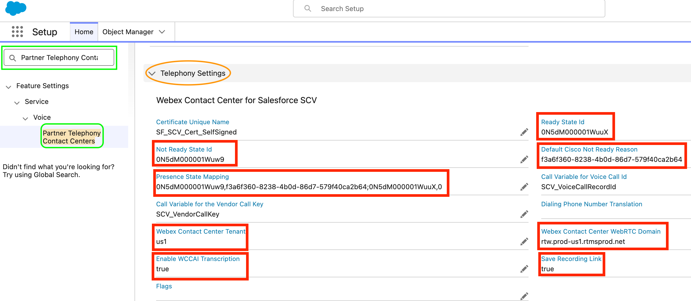


## Task 14

###<code style="color : green">**Assign user(s) to the Contact Center**</code>

* Click on the Contact Center Webex Contact Center created earlier
* Scroll down to Contact Center Users section and click on the Add button.
* Click on the + button next to the users that will have access to the open Contact Center and click Done

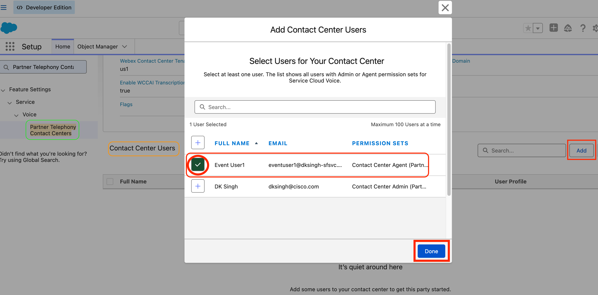


